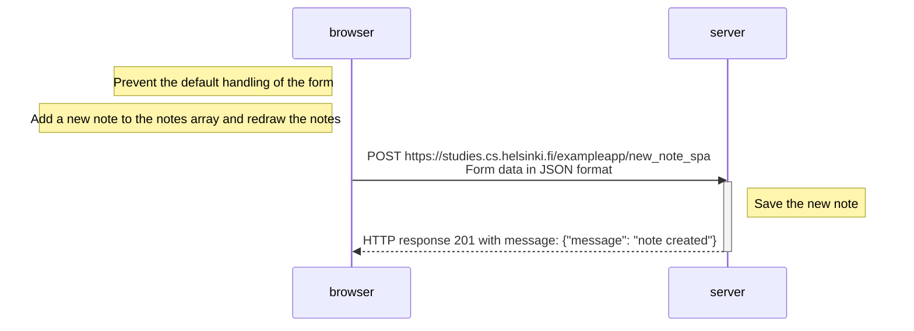

```mermaid
 sequenceDiagram
    participant browser
    participant server
    Note left of browser: Prevent the default handling of the form
    Note left of browser: Add a new note to the notes array and redraw the notes

    browser->>server: POST https://studies.cs.helsinki.fi/exampleapp/new_note_spa<br>Form data in JSON format
    activate server
    Note right of server: Save the new note
    server-->>browser: HTTP response 201 with message: {"message": "note created"}
    deactivate server

    
```
